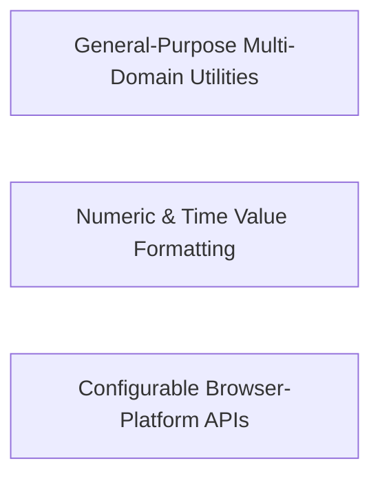

---
tags:
  - 2brain
  - 2brain/arch
  - project/js-toolkit
type: architecture
component: Core_Utility_Functions
---

## Details

The dominant public API surface of the library — 46 leaf helper modules spanning arrays, strings, numbers, time, JSON, errors, DOM manipulation, browser platform APIs (clipboard, cookies, downloads, URL queries, form data), and Node file operations, each exported as a single default function with no cross-dependencies.

### General-Purpose Multi-Domain Utilities [[Expand]](./General_Purpose_Multi_Domain_Utilities.md)
The dominant API surface of the library: 40 leaf modules spanning array manipulation, string processing, DOM manipulation, browser platform APIs, Node file operations, JSON helpers, and error extraction. Each module is a self-contained, side-effect-free function with a single default export. This group represents the long tail of the library — the breadth of composable primitives a consumer can import individually for tree-shaking.

**Related Classes/Methods**: _None_

**Source Files:**

- `src/appendChildren.ts`
  - `src.appendChildren.default` (L15-L34) - Function
- `src/arrayChunks.ts`
  - `src.arrayChunks.default` (L16-L37) - Function
- `src/arrayColumns.ts`
  - `src.arrayColumns.arrayColumns` (L25-L43) - Function
  - `src.arrayColumns.arrayColumns.haystack.map() callback` (L32-L42) - Function
- `src/arrayDepth.ts`
  - `src.arrayDepth.arrayDepth` (L13-L17) - Function
  - `src.arrayDepth.arrayDepth.check.map() callback` (L15-L15) - Function
- `src/associativeSlice.ts`
  - `src.associativeSlice.default` (L17-L33) - Function
- `src/canonicalize.ts`
  - `src.canonicalize.canonicalize.walk` (L28-L50) - Class
  - `src.canonicalize.canonicalize.walk.node.map() callback` (L40-L40) - Function
- `src/coerceStringArray.ts`
  - `src.coerceStringArray.default` (L18-L29) - Function
  - `src.coerceStringArray.default.value.map() callback` (L19-L19) - Function
  - `src.coerceStringArray.default.map() callback` (L23-L23) - Function
- `src/copyToClipboard.ts`
  - `src.copyToClipboard.default` (L18-L51) - Function
- `src/deleteCookie.ts`
  - `src.deleteCookie.default` (L15-L22) - Function
- `src/deleteFile.ts`
  - `src.deleteFile.default` (L19-L31) - Function
  - `src.deleteFile.then() callback` (L23-L23) - Function
- `src/downloadBlob.ts`
  - `src.downloadBlob.default` (L15-L28) - Function
- `src/eventDelegate.ts`
  - `src.eventDelegate.default` (L22-L47) - Function
- `src/extractErrorMessage.ts`
  - `src.extractErrorMessage.default` (L50-L65) - Function
- `src/formatDuration.ts`
  - `src.formatDuration.IFormatDurationOptions` (L33-L44) - Interface
  - `src.formatDuration.default` (L60-L85) - Function
- `src/formatFlag.ts`
  - `src.formatFlag.default` (L18-L26) - Function
- `src/formatNodeList.ts`
  - `src.formatNodeList.default` (L17-L25) - Function
- `src/formatText.ts`
  - `src.formatText.default` (L16-L17) - Function
- `src/getCookie.ts`
  - `src.getCookie.default` (L13-L20) - Function
- `src/getDelta.ts`
  - `src.getDelta.default` (L22-L28) - Function
- `src/getElementCenter.ts`
  - `src.getElementCenter.default` (L16-L21) - Function
- `src/getExecTime.ts`
  - `src.getExecTime.default` (L14-L26) - Function
  - `src.getExecTime.default.then() callback` (L18-L25) - Function
- `src/getForm.ts`
  - `src.getForm.default` (L17-L33) - Function
- `src/getIframe.ts`
  - `src.getIframe.default` (L14-L26) - Function
- `src/getIndex.ts`
  - `src.getIndex.default` (L13-L18) - Function
- `src/getJson.ts`
  - `src.getJson.default` (L20-L31) - Function
- `src/getMapDistance.ts`
  - `src.getMapDistance.default` (L23-L24) - Function
- `src/getOverlapRange.ts`
  - `src.getOverlapRange.default` (L29-L38) - Function
- `src/getSiblings.ts`
  - `src.getSiblings.default` (L13-L19) - Function
  - `src.getSiblings.default.filter() callback` (L18-L18) - Function
- `src/getUrlQueries.ts`
  - `src.getUrlQueries.default` (L19-L36) - Function
- `src/getUuid.ts`
  - `src.getUuid.getUuid` (L18-L34) - Function
- `src/getValue.ts`
  - `src.getValue.default` (L15-L47) - Function
- `src/internal/resolveLocale.ts`
  - `src.internal.resolveLocale.default` (L14-L24) - Function
- `src/isInViewport.ts`
  - `src.isInViewport.default` (L14-L24) - Function
- `src/isJson.ts`
  - `src.isJson.default` (L23-L31) - Function
- `src/isWithinFileSize.ts`
  - `src.isWithinFileSize.default` (L19-L20) - Function
- `src/levenshteinDistance.ts`
  - `src.levenshteinDistance.default` (L26-L64) - Function
- `src/match.ts`
  - `src.match.IMatchOptions` (L23-L36) - Interface
  - `src.match.default` (L48-L79) - Function
- `src/rangeOverlaps.ts`
  - `src.rangeOverlaps.default` (L21-L34) - Function
- `src/setUrlQueries.ts`
  - `src.setUrlQueries.default` (L26-L49) - Function
- `src/timeToSeconds.ts`
  - `src.timeToSeconds.default` (L19-L24) - Function

### Numeric & Time Value Formatting
A tightly-scoped trio of formatting helpers that convert raw numeric values into human-readable strings: formatCurrency (locale-aware currency with Intl.NumberFormat), formatFileSize (byte-count to human-readable units), and secondsToTime (seconds to h:m:s display). Each exposes a typed options interface that constrains the caller's configuration surface. These are the library's presentation-layer helpers sitting at the boundary between raw data and UI display, and are the most likely candidates for locale-aware behavior.

**Related Classes/Methods**:

- `src.formatCurrency.default`:61-74
- `src.formatCurrency.IFormatCurrencyOptions`:14-32
- `src.formatFileSize.default`:52-75
- `src.formatFileSize.IFormatFileSizeOptions`:26-42
- `src.secondsToTime.default`:107-118

**Source Files:**

- `src/formatCurrency.ts`
  - `src.formatCurrency.IFormatCurrencyOptions` (L14-L32) - Interface
  - `src.formatCurrency.default` (L61-L74) - Function
- `src/formatFileSize.ts`
  - `src.formatFileSize.IFormatFileSizeOptions` (L26-L42) - Interface
  - `src.formatFileSize.default` (L52-L75) - Function
- `src/secondsToTime.ts`
  - `src.secondsToTime.ISecondsToTimeMap` (L11-L76) - Interface
  - `src.secondsToTime.default` (L107-L118) - Function

### Configurable Browser-Platform APIs
Three browser-platform helpers that require runtime configuration via typed options interfaces: formatDateTime (locale-aware date/time rendering), isAcceptedFileType (file-extension/MIME validation against a configurable allow-list), and setCookie (cookie creation with path, expiry, and security flags). Unlike the pure formatting helpers, these interact with browser state (cookies) or validate user-supplied file metadata, placing them at the browser-platform boundary. Their options interfaces encode security-relevant defaults, making them the library's primary surface for developer-configurable browser behavior.

**Related Classes/Methods**:

- `src.formatDateTime.default`:42-53
- `src.formatDateTime.IFormatDateTimeOptions`:13-28
- `src.isAcceptedFileType.default`:37-52
- `src.setCookie.default`:40-63
- `src.setCookie.ISetCookieOptions`:10-31

**Source Files:**

- `src/formatDateTime.ts`
  - `src.formatDateTime.IFormatDateTimeOptions` (L13-L28) - Interface
  - `src.formatDateTime.default` (L42-L53) - Function
- `src/isAcceptedFileType.ts`
  - `src.isAcceptedFileType.IIsAcceptedFileTypeOptions` (L11-L21) - Interface
  - `src.isAcceptedFileType.default` (L37-L52) - Function
  - `src.isAcceptedFileType.default.accepted.some() callback` (L45-L51) - Function
- `src/setCookie.ts`
  - `src.setCookie.ISetCookieOptions` (L10-L31) - Interface
  - `src.setCookie.default` (L40-L63) - Function
