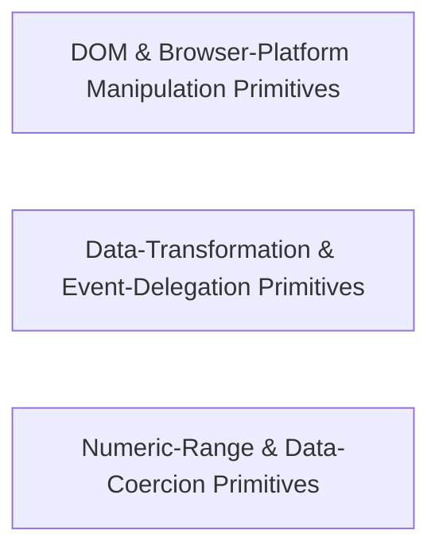

---
tags:
  - 2brain
  - 2brain/arch
  - project/js-toolkit
type: architecture
component: General_Purpose_Multi_Domain_Utilities
---

## Details

The dominant API surface of the library: 40 leaf modules spanning array manipulation, string processing, DOM manipulation, browser platform APIs, Node file operations, JSON helpers, and error extraction. Each module is a self-contained, side-effect-free function with a single default export. This group represents the long tail of the library — the breadth of composable primitives a consumer can import individually for tree-shaking.

### DOM & Browser-Platform Manipulation Primitives
The browser-environment half of the API surface. This group is dominated by DOM tree manipulation (appending children, querying siblings, locating element geometry, extracting forms/iframes) and browser platform APIs (cookie deletion, blob download), interleaved with a few formatting and array helpers. Each module is a pure leaf function that touches document/window only at call time, keeping the module side-effect-free for tree-shaking.

**Related Classes/Methods**:

- `src.appendChildren.default`:15-34
- `src.getSiblings.default`:13-19
- `src.getElementCenter.default`:16-21
- `src.downloadBlob.default`:15-28
- `src.formatDuration.default`:60-85

**Source Files:**

- `src/appendChildren.ts`
  - `src.appendChildren.default` (L15-L34) - Function
- `src/arrayColumns.ts`
  - `src.arrayColumns.arrayColumns.haystack.map() callback` (L32-L42) - Function
- `src/associativeSlice.ts`
  - `src.associativeSlice.default` (L17-L33) - Function
- `src/coerceStringArray.ts`
  - `src.coerceStringArray.default.map() callback` (L23-L23) - Function
- `src/deleteCookie.ts`
  - `src.deleteCookie.default` (L15-L22) - Function
- `src/downloadBlob.ts`
  - `src.downloadBlob.default` (L15-L28) - Function
- `src/formatDuration.ts`
  - `src.formatDuration.IFormatDurationOptions` (L33-L44) - Interface
  - `src.formatDuration.default` (L60-L85) - Function
- `src/formatText.ts`
  - `src.formatText.default` (L16-L17) - Function
- `src/getElementCenter.ts`
  - `src.getElementCenter.default` (L16-L21) - Function
- `src/getForm.ts`
  - `src.getForm.default` (L17-L33) - Function
- `src/getJson.ts`
  - `src.getJson.default` (L20-L31) - Function
- `src/getSiblings.ts`
  - `src.getSiblings.default` (L13-L19) - Function
- `src/getUuid.ts`
  - `src.getUuid.getUuid` (L18-L34) - Function
- `src/isInViewport.ts`
  - `src.isInViewport.default` (L14-L24) - Function
- `src/levenshteinDistance.ts`
  - `src.levenshteinDistance.default` (L26-L64) - Function
- `src/setUrlQueries.ts`
  - `src.setUrlQueries.default` (L26-L49) - Function

### Data-Transformation & Event-Delegation Primitives
Centered on array/data reshaping (chunking, depth, canonicalization, string coercion) and DOM event delegation, with supporting Node file operations, numeric distance, and string matching. This group represents the transform input data and wire up delegated listeners lane of the library — pure data functions plus one stateful-but-removable event binding.

**Related Classes/Methods**:

- `src.arrayChunks.default`:16-37
- `src.arrayDepth.arrayDepth`:13-17
- `src.eventDelegate.default`:22-47
- `src.match.default`:48-79

**Source Files:**

- `src/arrayChunks.ts`
  - `src.arrayChunks.default` (L16-L37) - Function
- `src/arrayDepth.ts`
  - `src.arrayDepth.arrayDepth` (L13-L17) - Function
- `src/canonicalize.ts`
  - `src.canonicalize.canonicalize.walk` (L28-L50) - Class
  - `src.canonicalize.canonicalize.walk.node.map() callback` (L40-L40) - Function
- `src/coerceStringArray.ts`
  - `src.coerceStringArray.default.value.map() callback` (L19-L19) - Function
- `src/deleteFile.ts`
  - `src.deleteFile.default` (L19-L31) - Function
- `src/eventDelegate.ts`
  - `src.eventDelegate.default` (L22-L47) - Function
- `src/formatFlag.ts`
  - `src.formatFlag.default` (L18-L26) - Function
- `src/getCookie.ts`
  - `src.getCookie.default` (L13-L20) - Function
- `src/getExecTime.ts`
  - `src.getExecTime.default` (L14-L26) - Function
- `src/getIframe.ts`
  - `src.getIframe.default` (L14-L26) - Function
- `src/getMapDistance.ts`
  - `src.getMapDistance.default` (L23-L24) - Function
- `src/getSiblings.ts`
  - `src.getSiblings.default.filter() callback` (L18-L18) - Function
- `src/getValue.ts`
  - `src.getValue.default` (L15-L47) - Function
- `src/isJson.ts`
  - `src.isJson.default` (L23-L31) - Function
- `src/match.ts`
  - `src.match.IMatchOptions` (L23-L36) - Interface
  - `src.match.default` (L48-L79) - Function
- `src/timeToSeconds.ts`
  - `src.timeToSeconds.default` (L19-L24) - Function

### Numeric-Range & Data-Coercion Primitives
Dominated by numeric/range computation (delta, index, overlap magnitude, range-overlap) and data coercion (string-array coercion, file-size/type checks), plus error-message extraction and a few browser helpers (clipboard, URL queries). This is the compute over numbers and coerce/validate inputs lane — the most mathematically pure of the three groups.

**Related Classes/Methods**:

- `src.rangeOverlaps.default`:21-34
- `src.getOverlapRange.default`:29-38
- `src.getDelta.default`:22-28
- `src.coerceStringArray.default`:18-29
- `src.extractErrorMessage.default`:50-65

**Source Files:**

- `src/arrayColumns.ts`
  - `src.arrayColumns.arrayColumns` (L25-L43) - Function
- `src/arrayDepth.ts`
  - `src.arrayDepth.arrayDepth.check.map() callback` (L15-L15) - Function
- `src/coerceStringArray.ts`
  - `src.coerceStringArray.default` (L18-L29) - Function
- `src/copyToClipboard.ts`
  - `src.copyToClipboard.default` (L18-L51) - Function
- `src/deleteFile.ts`
  - `src.deleteFile.then() callback` (L23-L23) - Function
- `src/extractErrorMessage.ts`
  - `src.extractErrorMessage.default` (L50-L65) - Function
- `src/formatNodeList.ts`
  - `src.formatNodeList.default` (L17-L25) - Function
- `src/getDelta.ts`
  - `src.getDelta.default` (L22-L28) - Function
- `src/getExecTime.ts`
  - `src.getExecTime.default.then() callback` (L18-L25) - Function
- `src/getIndex.ts`
  - `src.getIndex.default` (L13-L18) - Function
- `src/getOverlapRange.ts`
  - `src.getOverlapRange.default` (L29-L38) - Function
- `src/getUrlQueries.ts`
  - `src.getUrlQueries.default` (L19-L36) - Function
- `src/internal/resolveLocale.ts`
  - `src.internal.resolveLocale.default` (L14-L24) - Function
- `src/isWithinFileSize.ts`
  - `src.isWithinFileSize.default` (L19-L20) - Function
- `src/rangeOverlaps.ts`
  - `src.rangeOverlaps.default` (L21-L34) - Function
