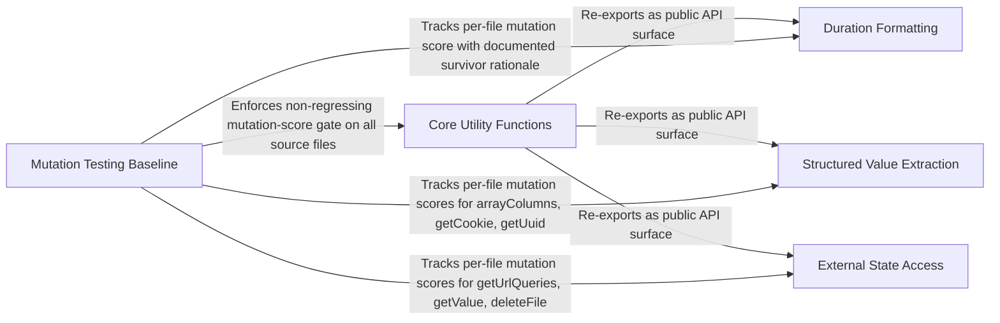

---
tags:
  - 2brain
  - 2brain/arch
  - project/js-toolkit
type: architecture
component: overview
---

## Details

This is a zero-dependency, tree-shakeable TypeScript utility library organized as a flat collection of single-responsibility helper functions. The architecture follows a leaf-function pattern where each src/*.ts file exports one focused utility (array manipulation, string processing, DOM interaction, browser platform APIs, Node file operations, time formatting). The public API surface is exposed through a barrel index.ts, with internal helpers isolated in src/internal/. The library is dual-built (ESM + CommonJS) with a rigorous quality pipeline that includes mutation testing with a baseline gate. The primary data flow is fan-out: index.ts re-exports all leaf functions; each function is self-contained. Sub-components represent functions whose internal control flow is complex enough to warrant visual distinction (multi-step pipelines, async chains, or collection transformations), while the mutation-testing quality script sits outside the runtime library as a CI/quality-pipeline artifact.

### Core Utility Functions [[Expand]](./Core_Utility_Functions.md)
The dominant public API surface of the library — 46 leaf helper modules spanning arrays, strings, numbers, time, JSON, errors, DOM manipulation, browser platform APIs (clipboard, cookies, downloads, URL queries, form data), and Node file operations, each exported as a single default function with no cross-dependencies.

**Related Classes/Methods**:

- `src.appendChildren.default`:15-34
- `src.arrayChunks.default`:16-37
- `src.copyToClipboard.default`:18-51
- `src.eventDelegate.default`:22-47
- `src.downloadBlob.default`:15-28

**Source Files:**

- `src/appendChildren.ts`
  - `src.appendChildren.default` (L15-L34) - Function
- `src/arrayChunks.ts`
  - `src.arrayChunks.default` (L16-L37) - Function
- `src/arrayColumns.ts`
  - `src.arrayColumns.arrayColumns` (L25-L43) - Function
  - `src.arrayColumns.arrayColumns.haystack.map() callback` (L32-L42) - Function
- `src/arrayDepth.ts`
  - `src.arrayDepth.arrayDepth` (L13-L17) - Function
  - `src.arrayDepth.arrayDepth.check.map() callback` (L15-L15) - Function
- `src/associativeSlice.ts`
  - `src.associativeSlice.default` (L17-L33) - Function
- `src/canonicalize.ts`
  - `src.canonicalize.canonicalize.walk` (L28-L50) - Class
  - `src.canonicalize.canonicalize.walk.node.map() callback` (L40-L40) - Function
- `src/coerceStringArray.ts`
  - `src.coerceStringArray.default` (L18-L29) - Function
  - `src.coerceStringArray.default.value.map() callback` (L19-L19) - Function
  - `src.coerceStringArray.default.map() callback` (L23-L23) - Function
- `src/copyToClipboard.ts`
  - `src.copyToClipboard.default` (L18-L51) - Function
- `src/deleteCookie.ts`
  - `src.deleteCookie.default` (L15-L22) - Function
- `src/deleteFile.ts`
  - `src.deleteFile.default` (L19-L31) - Function
  - `src.deleteFile.then() callback` (L23-L23) - Function
- `src/downloadBlob.ts`
  - `src.downloadBlob.default` (L15-L28) - Function
- `src/eventDelegate.ts`
  - `src.eventDelegate.default` (L22-L47) - Function
- `src/extractErrorMessage.ts`
  - `src.extractErrorMessage.default` (L50-L65) - Function
- `src/formatCurrency.ts`
  - `src.formatCurrency.IFormatCurrencyOptions` (L14-L32) - Interface
  - `src.formatCurrency.default` (L61-L74) - Function
- `src/formatDateTime.ts`
  - `src.formatDateTime.IFormatDateTimeOptions` (L13-L28) - Interface
  - `src.formatDateTime.default` (L42-L53) - Function
- `src/formatDuration.ts`
  - `src.formatDuration.IFormatDurationOptions` (L33-L44) - Interface
  - `src.formatDuration.default` (L60-L85) - Function
- `src/formatFileSize.ts`
  - `src.formatFileSize.IFormatFileSizeOptions` (L26-L42) - Interface
  - `src.formatFileSize.default` (L52-L75) - Function
- `src/formatFlag.ts`
  - `src.formatFlag.default` (L18-L26) - Function
- `src/formatNodeList.ts`
  - `src.formatNodeList.default` (L17-L25) - Function
- `src/formatText.ts`
  - `src.formatText.default` (L16-L17) - Function
- `src/getCookie.ts`
  - `src.getCookie.default` (L13-L20) - Function
- `src/getDelta.ts`
  - `src.getDelta.default` (L22-L28) - Function
- `src/getElementCenter.ts`
  - `src.getElementCenter.default` (L16-L21) - Function
- `src/getExecTime.ts`
  - `src.getExecTime.default` (L14-L26) - Function
  - `src.getExecTime.default.then() callback` (L18-L25) - Function
- `src/getForm.ts`
  - `src.getForm.default` (L17-L33) - Function
- `src/getIframe.ts`
  - `src.getIframe.default` (L14-L26) - Function
- `src/getIndex.ts`
  - `src.getIndex.default` (L13-L18) - Function
- `src/getJson.ts`
  - `src.getJson.default` (L20-L31) - Function
- `src/getMapDistance.ts`
  - `src.getMapDistance.default` (L23-L24) - Function
- `src/getOverlapRange.ts`
  - `src.getOverlapRange.default` (L29-L38) - Function
- `src/getSiblings.ts`
  - `src.getSiblings.default` (L13-L19) - Function
  - `src.getSiblings.default.filter() callback` (L18-L18) - Function
- `src/getUrlQueries.ts`
  - `src.getUrlQueries.default` (L19-L36) - Function
- `src/getUuid.ts`
  - `src.getUuid.getUuid` (L18-L34) - Function
- `src/getValue.ts`
  - `src.getValue.default` (L15-L47) - Function
- `src/internal/resolveLocale.ts`
  - `src.internal.resolveLocale.default` (L14-L24) - Function
- `src/isAcceptedFileType.ts`
  - `src.isAcceptedFileType.IIsAcceptedFileTypeOptions` (L11-L21) - Interface
  - `src.isAcceptedFileType.default` (L37-L52) - Function
  - `src.isAcceptedFileType.default.accepted.some() callback` (L45-L51) - Function
- `src/isInViewport.ts`
  - `src.isInViewport.default` (L14-L24) - Function
- `src/isJson.ts`
  - `src.isJson.default` (L23-L31) - Function
- `src/isWithinFileSize.ts`
  - `src.isWithinFileSize.default` (L19-L20) - Function
- `src/levenshteinDistance.ts`
  - `src.levenshteinDistance.default` (L26-L64) - Function
- `src/match.ts`
  - `src.match.IMatchOptions` (L23-L36) - Interface
  - `src.match.default` (L48-L79) - Function
- `src/rangeOverlaps.ts`
  - `src.rangeOverlaps.default` (L21-L34) - Function
- `src/secondsToTime.ts`
  - `src.secondsToTime.ISecondsToTimeMap` (L11-L76) - Interface
  - `src.secondsToTime.default` (L107-L118) - Function
- `src/setCookie.ts`
  - `src.setCookie.ISetCookieOptions` (L10-L31) - Interface
  - `src.setCookie.default` (L40-L63) - Function
- `src/setUrlQueries.ts`
  - `src.setUrlQueries.default` (L26-L49) - Function
- `src/timeToSeconds.ts`
  - `src.timeToSeconds.default` (L19-L24) - Function

### Mutation Testing Baseline
The quality-gate script that scores, sorts, and tracks mutation-testing results per file, maintaining a baseline of surviving mutant counts to enforce a regression threshold in CI.

**Related Classes/Methods**:

- `scripts.mutation-baseline.sorted`:231-233
- `scripts.mutation-baseline.scoreFile.count`
- `scripts.mutation-baseline.baseline.map() callback`
- `scripts.mutation-baseline.sorted.toSorted() callback`

**Source Files:**

- `scripts/mutation-baseline.mjs`
  - `scripts.mutation-baseline.scoreFile.count` (L68-L68) - Class
  - `scripts.mutation-baseline.scoreFile.count.mutants.filter() callback` (L68-L68) - Function
  - `scripts.mutation-baseline.baseline.toSorted() callback` (L110-L110) - Function
  - `scripts.mutation-baseline.baseline.map() callback` (L111-L111) - Function
  - `scripts.mutation-baseline.sorted` (L231-L233) - Class
  - `scripts.mutation-baseline.sorted.toSorted() callback` (L232-L232) - Function

### Duration Formatting
The formatDuration helper's internal control flow — ordering time-unit values, filtering to the first non-zero segment, and mapping them into a human-readable duration string (e.g. "2m 30s").

**Related Classes/Methods**:

- `src.formatDuration.default.ordered`
- `src.formatDuration.default.firstNonZero`
- `src.formatDuration.default.values`:71-75
- `src.formatDuration.default.ordered.sort() callback`
- `src.formatDuration.default.firstNonZero.values.findIndex() callback`

**Source Files:**

- `src/formatDuration.ts`
  - `src.formatDuration.default.ordered` (L66-L66) - Class
  - `src.formatDuration.default.ordered.sort() callback` (L66-L66) - Function
  - `src.formatDuration.default.values` (L71-L75) - Class
  - `src.formatDuration.default.values.ordered.map() callback` (L71-L75) - Function
  - `src.formatDuration.default.firstNonZero` (L78-L78) - Class
  - `src.formatDuration.default.firstNonZero.values.findIndex() callback` (L78-L78) - Function
  - `src.formatDuration.default.map() callback` (L83-L83) - Function

### Structured Value Extraction
Helpers that extract or generate specific structured values from collections — pulling named columns from an array of objects, locating a cookie entry by name, and generating the hex-character sequence for a UUID.

**Related Classes/Methods**:

- `src.arrayColumns.arrayColumns.haystack.map() callback.values`:33-39
- `src.getCookie.default.cookieRow`:15-17
- `src.getUuid.getUuid.hex`
- `src.getCookie.default.cookieRow.find() callback`
- `src.getUuid.getUuid.hex.map() callback`

**Source Files:**

- `src/arrayColumns.ts`
  - `src.arrayColumns.arrayColumns.haystack.map() callback.values.columnsArray.map() callback` (L33-L38) - Function
  - `src.arrayColumns.arrayColumns.haystack.map() callback.values` (L33-L39) - Class
- `src/getCookie.ts`
  - `src.getCookie.default.cookieRow` (L15-L17) - Class
  - `src.getCookie.default.cookieRow.find() callback` (L17-L17) - Function
- `src/getUuid.ts`
  - `src.getUuid.getUuid.hex` (L32-L32) - Class
  - `src.getUuid.getUuid.hex.map() callback` (L32-L32) - Function

### External State Access
Helpers that read from or mutate external runtime state — parsing URL query parameters, extracting form field values (including checkbox state), and performing async filesystem deletion with error handling.

**Related Classes/Methods**:

- `src.getUrlQueries.default.values`:29-31
- `src.getValue.default.checked`:40-42
- `src.deleteFile.default.catch() callback`:25-31
- `src.getUrlQueries.default.values.flatMap() callback`
- `src.getValue.default.checked.find() callback`

**Source Files:**

- `src/deleteFile.ts`
  - `src.deleteFile.default.then() callback` (L24-L24) - Function
  - `src.deleteFile.default.catch() callback` (L25-L31) - Function
- `src/getUrlQueries.ts`
  - `src.getUrlQueries.default.values` (L29-L31) - Class
  - `src.getUrlQueries.default.values.flatMap() callback` (L31-L31) - Function
- `src/getValue.ts`
  - `src.getValue.default.checked` (L40-L42) - Class
  - `src.getValue.default.checked.find() callback` (L42-L42) - Function
