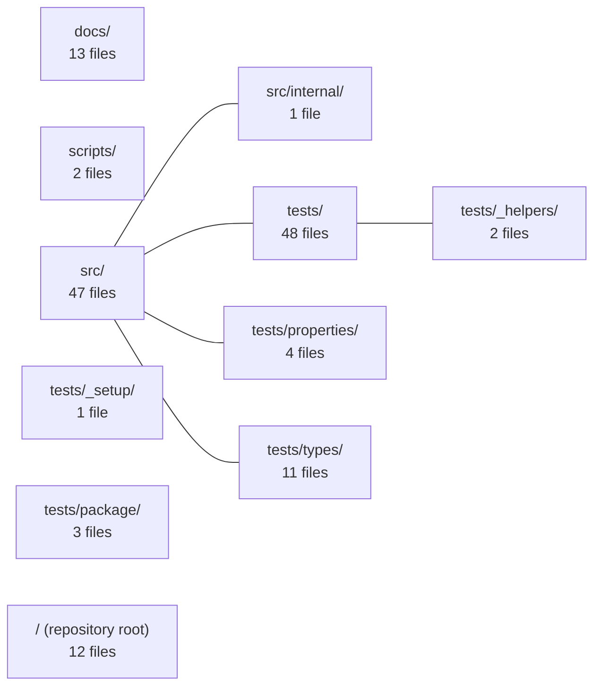

---
tags:
  - 2brain
  - 2brain/index
  - project/js-toolkit
type: index
modules: 11
updated: 2026-09-28T20:03:01.853370+00:00
---

# js-toolkit

`js-toolkit` is a JavaScript (TypeScript) utility library whose implementation lives in `src/` (with a small `src/internal/` sub-package), accompanied by user-facing documentation in `docs/` and build/automation scripts in `scripts/`. A substantial test suite under `tests/` is subdivided into helpers, setup, package-integration, property-based, and type-level test files. The repository root holds the remaining top-level configuration and metadata files.

## Module map

## Modules
- [[js-toolkit_docs|docs/]] — 13 files, 0 connected modules
- [[js-toolkit_scripts|scripts/]] — 2 files, 0 connected modules
- [[js-toolkit_src|src/]] — 47 files, 4 connected modules
- [[js-toolkit_src_internal|src/internal/]] — 1 file, 1 connected module
- [[js-toolkit_tests|tests/]] — 48 files, 2 connected modules
- [[js-toolkit_tests__helpers|tests/_helpers/]] — 2 files, 1 connected module
- [[js-toolkit_tests__setup|tests/_setup/]] — 1 file, 0 connected modules
- [[js-toolkit_tests_package|tests/package/]] — 3 files, 0 connected modules
- [[js-toolkit_tests_properties|tests/properties/]] — 4 files, 1 connected module
- [[js-toolkit_tests_types|tests/types/]] — 11 files, 1 connected module
- [[js-toolkit_ROOT|/ (repository root)]] — 12 files, 0 connected modules
