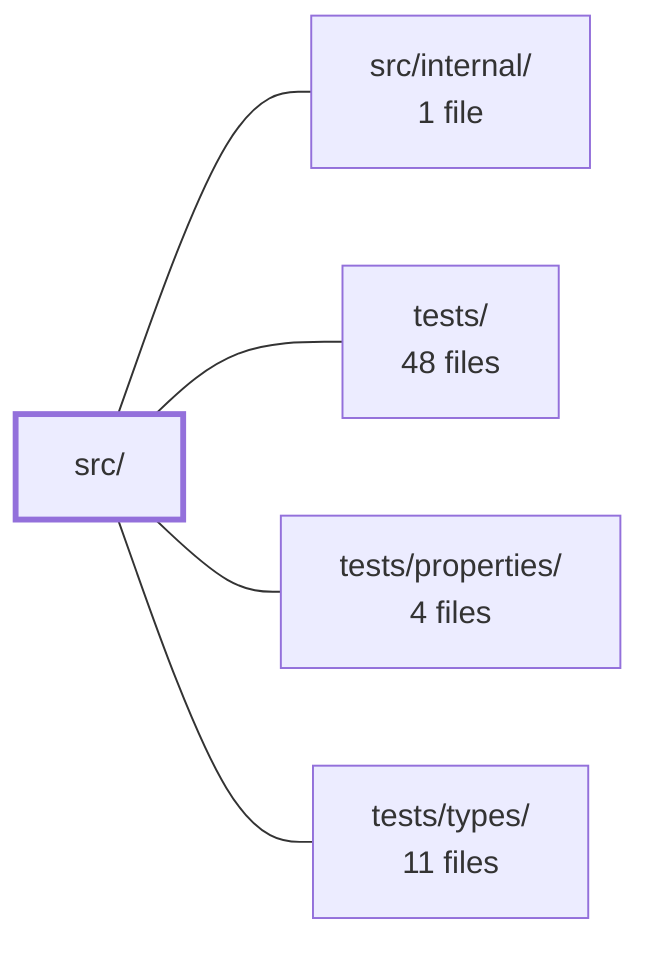

---
tags:
    - 2brain
    - 2brain/module
    - project/js-toolkit
type: module
module: src/
files: 47
updated: 2026-09-28T20:01:02.120590+00:00
---

# src/

## Purpose

`src/` is a zero-dependency (or near-zero) utility library that provides small, single-purpose helpers for DOM manipulation, array/object shaping, value formatting, browser-API wrappers, and a few mathematical primitives. Every file exports exactly one function (or a tiny tightly-coupled pair), and `index.ts` re-exports them all so consumers can import from a single entry point. The module exists so application code never has to re-implement repetitive, low-level logic inline.

## Key parts

- **Barrel / public surface** — `index.ts` re-exports every helper under its own name and surfaces a handful of option/result types. Adding a new helper means adding one export line here.
- **DOM helpers** — `appendChildren`, `eventDelegate`, `formatNodeList`, `getSiblings`, `getIndex`, `getElementCenter`, `isInViewport`, `getForm`, `getValue`, `getIframe`. Together they cover the recurring "talk to the live DOM without a framework" needs (delegated events, child enumeration, viewport checks, form snapshotting, safe iframe access).
- **Array & object shaping** — `arrayChunks`, `arrayColumns`, `arrayDepth`, `associativeSlice`, `coerceStringArray`. Small, pure functions for partitioning, projection, nesting inspection, positional object slicing, and normalising heterogeneous input into a flat string array.
- **Formatting & display** — `formatCurrency`, `formatDateTime`, `formatDuration`, `formatFileSize`, `formatFlag`, `formatText`. All are locale-aware, throw-safe renderers that degrade gracefully on bad input so a UI cell never shows `"Invalid Date"` or a blank space.
- **Browser-API shims** — `getCookie`, `deleteCookie`, `copyToClipboard`, `downloadBlob`, `deleteFile`. Thin wrappers around APIs that have no native convenience method (no "delete cookie", no "save Blob", no guaranteed clipboard API).
- **Parsing & validation** — `getJson`, `isJson`, `getUrlQueries`, `isAcceptedFileType`, `isWithinFileSize`, `canonicalize`. Parse or validate a value and return a clean result (or `undefined` / `false`) instead of throwing, so callers can treat edge-cases as normal values.
- **Math / geometry primitives** — `getDelta`, `getMapDistance`, `getOverlapRange`, `levenshteinDistance`, `getExecTime`. Low-level distance, range-intersection, string-metric, and timing utilities consumed by higher-level application logic.
- **Error & string extraction** — `extractErrorMessage`, `getUuid`. Pull a readable message out of an arbitrary rejection shape; generate a v4 UUID without a dependency.

## How it connects

- **`src/internal/`** — Houses private helpers and shared types that the public utilities depend on but that are not re-exported through `index.ts`. The public functions in `src/` import from this directory for non-trivial shared logic (e.g. canonicalisation internals, internal formatters) while keeping the public API surface flat.
- **`tests/`** — Unit and integration tests that import the barrel (`src/index.ts`) and exercise each helper's contract. The one-function-per-file layout in `src/` maps 1-to-1 onto test files here.
- **`tests/properties/`** — Property-based tests (e.g. `arrayChunks` length invariants, `canonicalize` round-trip stability, `levenshteinDistance` triangle inequality) that verify invariants across random inputs rather than fixed examples.
- **`tests/types/`** — Compile-time type-assertion tests that lock down the public signatures exported from `src/index.ts`, catching accidental API drift at build time.

## Where to start

1. **`src/index.ts`** — Read the barrel file first. It is the complete public API in one view; skimming its export list tells you exactly what the module offers and what option/result types are available.
2. **`src/eventDelegate.ts`** or **`src/formatNodeList.ts`** — Pick one DOM helper and trace how a "framework-free" DOM utility is structured: a single default-exported function, minimal parameters, defensive guards for `null`/detached nodes, and a comment explaining _why_ the helper exists. This pattern repeats across the module and sets the expectation for every other file.

## Connected modules

[[js-toolkit_src_internal|src/internal/]] · [[js-toolkit_tests|tests/]] · [[js-toolkit_tests_properties|tests/properties/]] · [[js-toolkit_tests_types|tests/types/]]

## Files

- `src/appendChildren.ts` — Provides a single helper that appends one or more child nodes (or nested arrays of nodes) to a parent element using a `DocumentFragment`, ensuring the live DOM is mutated exactly once regardless of how many children are passed.
- `src/arrayChunks.ts` — Provides a single utility function that splits an array into `n` sub-arrays whose lengths differ by at most one element. It exists so callers get a balanced chunking without duplicating the distribution logic (e.g. spreading the remainder across the first chunks rather than dumping it into the last).
- `src/arrayColumns.ts` — A single-function module that mirrors PHP's `array_column`: it extracts one or more named properties from each record in an array of objects. It always preserves a 1-to-1 slot count with the input so the result can be zipped back by index.
- `src/arrayDepth.ts` — Provides a single utility function that computes the nesting depth of a (possibly nested) array by recursive inspection: a non-array value has depth 0, and an array has depth 1 + the maximum depth of its elements.
- `src/associativeSlice.ts` — Provides an object-slice utility that selects own enumerable properties by enumeration index, giving objects the same `[start, end)` range semantics that `Array.prototype.slice` gives to arrays. It exists so callers can grab a positional window of an object's keys without manual key-listing.
- `src/canonicalize.ts` — Canonicalizes an arbitrary value into a deterministic shape so that `JSON.stringify` of the result is a stable cache key, independent of property insertion order. It exists to give the rest of the codebase a single, correct way to normalize filter/config objects before hashing or caching, avoiding the common pitfall of sorting only top-level keys.
- `src/coerceStringArray.ts` — Normalizes an arbitrary value into a flat array of trimmed, non-empty strings so callers never need to branch on "single string" vs. "comma-separated string" vs. "already an array" vs. "nullish" input shapes.
- `src/copyToClipboard.ts` — Provides a single utility that copies a string to the system clipboard, using the modern async Clipboard API when available and falling back to `document.execCommand('copy')` otherwise. It exists so callers can trigger a clipboard write without handling errors or worrying about browser compatibility — the function always resolves to a boolean.
- `src/deleteCookie.ts` — Provides the single supported mechanism for removing a browser cookie: rewriting it with the same `name`/`path`/`domain` but a long-past expiry date, causing the browser to discard it. Exists because the DOM exposes no true "delete cookie" API.
- `src/deleteFile.ts` — Provides a single, fire-and-forget file deletion helper that **never rejects**. It exists so callers can attempt to remove a file without wrapping the call in `try/catch` or handling a rejected promise — success is a `true`/`false` resolution, and optional failure reporting is handled via a callback.
- `src/downloadBlob.ts` — Provides a client-side file-download utility. Because the browser exposes no direct "save this Blob" API, this module fakes a user-initiated download by programmatically clicking a detached `<a>` element whose `href` points to a temporary object URL.
- `src/eventDelegate.ts` — Implements event delegation: a single listener on a stable ancestor handles events for many current **and future** children. Instead of attaching one listener per child, every event is matched against a selector inside the one registered listener.
- `src/extractErrorMessage.ts` — Extracts a human-readable message from whatever a `catch` block or promise rejection hands you, regardless of shape. It exists because HTTP clients (axios, interceptors, normalisers) frequently reject with plain object literals rather than `Error` instances, causing naive `instanceof Error` checks to miss the server's message entirely.
- `src/formatCurrency.ts` — Renders a numeric amount as a localized currency string via `Intl.NumberFormat` in currency style. It exists so callers get a single, safe formatting entry point that never throws on bad input (non-numeric values, malformed currency codes, unusable locales) and instead degrades gracefully to a plain decimal or a caller-supplied placeholder.
- `src/formatDateTime.ts` — Renders a date value into a locale-aware display string. Wraps `Intl.DateTimeFormat` (or `Date#toLocaleString` as a simpler fallback) behind a small API that guarantees no "Invalid Date" text ever reaches a user and that a bad locale silently degrades to the runtime default.
- `src/formatDuration.ts` — Converts a duration in seconds into a compact, human-readable string (e.g. `2h 15m`) by cascading through a fixed list of units largest-first. Exists to give the rest of the codebase a single, dependency-free way to render durations for status lines and metrics panels.
- `src/formatFileSize.ts` — Pure formatting utility that renders a raw byte count as a human-readable string (e.g. `5 MB`, `1.5 MB`) by selecting the appropriate unit and applying a fixed divisor. Exists so callers never have to repeat the unit-selection math inline.
- `src/formatFlag.ts` — Provides a single formatting utility that renders a tri-state flag (`true`, `false`, or nullish) as a human-readable label. It exists to keep "unset" visually distinct from "false," since coercing a nullish value to `false` would assert a state the data does not actually hold.
- `src/formatNodeList.ts` — Normalises the various shapes a DOM query can return (single element, plain array, live `NodeList`, or `HTMLCollection`) into a single plain `HTMLElement[]`, so downstream code never needs to branch on input type.
- `src/formatText.ts` — Provides a single display guard: when a UI cell's string value is missing, null, or whitespace-only, it substitutes a visible placeholder glyph (default `'—'`) so the layout never shows a confusingly empty cell.
- `src/getCookie.ts` — Provides a small helper to read a single cookie's value by name from `document.cookie`, which has no built-in lookup-by-name API. It encapsulates the split → match → decode steps so callers get a clean `string | undefined` return instead of parsing the raw `"a=1; b=2"` string themselves.
- `src/getDelta.ts` — Computes the distance between two numbers, either linearly or as the shorter arc on a wrapping circle of a given circumference. It exists as a low-level primitive that higher-level distance functions (e.g. map distance) rely on to handle both open and periodic axes uniformly.
- `src/getElementCenter.ts` — Provides a single utility to compute the geometric centre of a DOM element as a pair of viewport-relative coordinates, derived from its bounding rect.
- `src/getExecTime.ts` — A tiny utility that measures the wall-clock execution time of any function (sync or async) using Node's monotonic nanosecond clock, returning the function's result together with the elapsed duration in milliseconds.
- `src/getForm.ts` — Collects the current values of all named form fields within a given `<form>` element into a single `Record<string, unknown>` map keyed by each field's `name` attribute. It exists so callers can snapshot a form's state in one call without manually iterating fields or handling per-type value extraction.
- `src/getIframe.ts` — Safely retrieves the `<body>` element from an iframe's _own_ document (i.e. `contentWindow.document.body`), guarding against the element not actually being an iframe, the iframe being detached, or the window not yet being available. It exists so callers can access cross-document DOM without risking a `TypeError` on a null `contentWindow`.
- `src/getIndex.ts` — Provides a single utility that returns a DOM element's zero-based position among its parent's children (or `-1` when the element is null or detached). It exists as a lightweight, framework-free stand-in for jQuery's `.index()` so the codebase can query sibling position without a library dependency.
- `src/getJson.ts` — A thin wrapper around `JSON.parse` that converts the thrown `SyntaxError` into an `undefined` return value, allowing callers to treat "not valid JSON" as a normal value rather than handling a control-flow exception.
- `src/getMapDistance.ts` — Computes the straight-line (Euclidean) distance between two points on a map. By delegating each axis to `getDelta`, it supports optional wrap-around (toroidal) distance when a map `size` is provided, then combines the two axis deltas with `Math.hypot`.
- `src/getOverlapRange.ts` — Computes the intersection (overlap) of two numeric ranges and returns the resulting `[start, end]` tuple. It exists to provide a single, reusable primitive for determining the shared interval between any two ranges (e.g., time periods), with a well-defined sentinel for the "no overlap" case.
- `src/getSiblings.ts` — Provides a small utility that returns the sibling elements of a given DOM node (excluding the node itself). It exists as a dependency-free replacement for jQuery's `.siblings()` so the rest of the codebase can collect adjacent elements without pulling in a framework.
- `src/getUrlQueries.ts` — A single-function module that parses a URL query string into a plain `Record<string, string | string[]>`. It exists to provide a framework-agnostic, dependency-free way to read query parameters with multi-value support (repeated keys and separator-delimited values) without pulling in a router-specific utility.
- `src/getUuid.ts` — Provides a single utility for generating random RFC 4122 version-4 UUIDs. It exists to give callers one import that works across secure and non-secure browser origins without pulling in a dependency.
- `src/getValue.ts` — A single-purpose utility that extracts a meaningful value from an HTML form element, handling the type-specific semantics (checkbox state, radio group selection, attribute access) so callers don't repeat branching logic.
- `src/index.ts` — Package barrel file. It re-exports every helper's default export under its own name and surfaces a handful of option/result types so consumers can import from a single entry point. The file contains no logic of its own — adding a new public helper means adding one `export` line here.
- `src/isAcceptedFileType.ts` — Provides a single function that checks whether a file's declared MIME type matches an entry in a file input's `accept` list. Exists to give an early, client-side "this won't be accepted" signal before a user waits out an upload that the server would reject.
- `src/isInViewport.ts` — Provides a single-purpose utility that tests whether a DOM element is visible within the browser viewport, supporting both "fully contained" and "any overlap" semantics. It exists so callers can gate scroll-triggered behavior (lazy loading, animations, intersection checks) without re-implementing the rect/viewport comparison.
- `src/isJson.ts` — Provides a single, throw-safe helper for parsing a string into a JSON _structure_ (object or array). It exists so callers can distinguish "this is a walkable JSON structure" from every other case (parse failure, primitive value, `null`) with one boolean-like check, without wrapping `JSON.parse` in their own `try`/`catch`.
- `src/isWithinFileSize.ts` — A single pure predicate that checks whether a file-like object's `size` is within a caller-supplied byte limit. It exists as a client-side fail-fast guard so oversized files are rejected before any network upload begins; the server remains the authoritative enforcer.
- `src/levenshteinDistance.ts` — Implements the classic Wagner–Fischer dynamic-programming Levenshtein edit distance. It returns the minimum number of single-character insertions, deletions, or substitutions required to transform one string into another. Serves as the distance metric consumed by the fuzzy-matching logic in this project.
- `src/match.ts` — Provides a single string-comparison function that supports five comparison modes (exact, contains, contained, either, fuzzy) with optional case-sensitivity and a configurable edit-distance threshold. It centralises the "do these two strings match?" logic so callers don't reimplement trimming, normalisation, or distance checks.
- `src/rangeOverlaps.ts` — Provides a single utility that quantifies the overlap between two numeric intervals as a magnitude (number of units), returning `0` when the intervals do not intersect. Exists so callers can both test _whether_ two ranges overlap and _how much_ they overlap in one call.
- `src/secondsToTime.ts` — Converts a duration in milliseconds into a flat object containing both remainder-style breakdowns (years, months, weeks, …) and single-unit totals (`yearsOnly`, `monthsOnly`, …) using repeated integer division. It exists so callers can pick whichever representation they need without re-deriving the math.
- `src/setCookie.ts` — A single-purpose module that assembles a `document.cookie` attribute string from a name, value, and an optional set of cookie attributes, then performs one `document.cookie` assignment to add or update that cookie without affecting others.
- `src/setUrlQueries.ts` — Serializes a plain key/value object into a URL query string using `URLSearchParams`, with optional merging into an existing query string. It exists as a framework-agnostic utility so callers can build query strings for any router or apply them via `history.pushState`/`replaceState` without pulling in a specific framework.
- `src/timeToSeconds.ts` — Converts a delimited time string (e.g. `"14:30:05:250"`) into a **milliseconds** number. Components are optional and read from the left, so shorter strings like `"14:30"` are valid. It exists as a small, dependency-free utility so callers don't repeat split/parse arithmetic.
- `src/toFormData.ts` — Converts a plain JavaScript object into a `FormData` instance suitable for multipart/form-data uploads. Because `FormData` is inherently flat (strings and blobs only), this module encodes object nesting via PHP-style bracket keys (`user[tags][0]`), giving the server a parseable path back into the original structure.

---

[[js-toolkit_INDEX|← js-toolkit index]]
