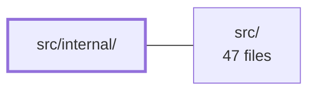

---
tags:
  - 2brain
  - 2brain/module
  - project/js-toolkit
type: module
module: src/internal/
files: 1
updated: 2026-09-28T20:01:13.016199+00:00
---

# src/internal/

## Purpose

This module provides small, internal utility functions that the rest of the codebase relies on. Currently it contains a single helper that guards against invalid locale strings before they are passed to `Intl` APIs, preventing runtime `RangeError` exceptions from malformed BCP 47 tags.

## Key parts

- **`resolveLocale.ts`** — Accepts a user-supplied locale string (or `undefined`) and returns either the original well-formed tag or `undefined`. Malformed values such as `'en_US'` or an empty string are normalised to `undefined` so that any downstream `Intl` constructor falls back to the runtime's default locale rather than throwing.

## How it connects

`src/` depends on this module: public-facing code in the top-level package calls `resolveLocale` to sanitise locale input before constructing `Intl.DateTimeFormat`, `Intl.NumberFormat`, or similar objects. By isolating the sanitisation logic here, the rest of `src/` can assume a safe value and skip repeated validation.

## Where to start

Read **`src/internal/resolveLocale.ts`** first. It is short, self-contained, and has no further imports—understanding its input/output contract (well-formed tag → pass-through, malformed/empty → `undefined`) is all you need before tracing how `src/` calls it.

## Connected modules

[[js-toolkit_src|src/]]

## Files
- `src/internal/resolveLocale.ts` — Sanitises a user-supplied locale string before it reaches any `Intl` constructor. Malformed BCP 47 tags (e.g. `'en_US'`, `''`) cause `Intl` to throw a `RangeError`; this module maps those cases onto `undefined` so the runtime's default locale is used instead, while passing through well-formed tags and `undefined` unchanged.

---
[[js-toolkit_INDEX|← js-toolkit index]]
