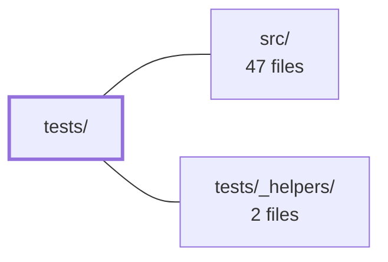

---
tags:
  - 2brain
  - 2brain/module
  - project/js-toolkit
type: module
module: tests/
files: 48
updated: 2026-09-28T20:01:36.780266+00:00
---

# tests/

## Purpose

The `tests/` directory contains the project's full Jest unit-test suite. Every `.spec.ts` file here targets a single utility exported from `src/`, pinning down its contract, edge-case behavior, and fallback semantics so that refactors and new features can be made with confidence.

## Key parts

- **Formatting & display utilities** – Specs for `formatCurrency`, `formatDateTime`, `formatDuration`, `formatFileSize`, `formatFlag`, `formatNodeList`, and `formatText` collectively lock in locale handling, unit decomposition, glyph substitution, and graceful-degradation boundaries.
- **DOM & browser APIs** – Specs for `eventDelegate`, `getElementCenter`, `getIndex`, `getIframe`, `getSiblings`, `isInViewport`, `appendChildren`, `copyToClipboard`, `deleteCookie`, and `getCookie` verify behavior against a jsdom environment (or a bare-Node environment where `location` must be absent, as in `getUrlQueries.node.spec.ts`).
- **Array & collection helpers** – Specs for `arrayChunks`, `arrayColumns`, `arrayDepth`, `associativeSlice`, `coerceStringArray`, and `canonicalize` codify splitting, extraction, nesting-depth, object-slicing, normalisation, and deterministic serialisation contracts.
- **Parsing, identity & safety** – `getJson`/`isJson` (safe-parse contracts), `getUuid` (CSPRNG fallback path), `extractErrorMessage` (error-shape normalisation), `getUrlQueries` (query-string parsing), and `isAcceptedFileType`/`isWithinFileSize` (file-type & size guards).
- **Math & geometry** – `getDelta`, `getMapDistance`, `getOverlapRange` (including fast-check property-based tests), and `getExecTime` cover distance, range-intersection, and timing-wrapper semantics.
- **Form utilities** – `getForm` and `getValue` pin down serialisation and value-retrieval across every form-control type.
- **Barrel smoke test** – `index.spec.ts` verifies that every re-export in `src/index.ts` resolves to a defined, callable function at runtime.
- **File I/O helpers** – `deleteFile` and `downloadBlob` test deletion (with `onError` callback) and Blob-to-download flow.

## How it connects

- **`src/`** – Every spec imports the utility under test from `src/index.ts` (or `../src`). The tests are the behavioural contract for the public API defined there; they run *after* `src/` in the build/test pipeline and never import from one another directly.
- **`tests/_helpers/`** – Shared mocks, DOM fixtures, and assertion helpers live here and are imported by individual specs to reduce duplication (e.g., stubbing `document.cookie`, simulating clipboard events, or building mock `NodeList` objects).

## Where to start

1. **`tests/index.spec.ts`** – A short, self-contained smoke test that walks the entire public surface. Reading it gives an instant inventory of every utility the library exposes.
2. **`tests/arrayChunks.spec.ts`** – A small, dependency-free spec that demonstrates the project's testing style (clear arrange/act/assert, edge-case calls, and inline expected output) without requiring DOM mocks, making it an easy reference for writing new tests.

## Connected modules

[[js-toolkit_src|src/]] · [[js-toolkit_tests__helpers|tests/_helpers/]]

## Files
- `tests/appendChildren.spec.ts` — Unit tests for the `appendChildren` utility, verifying that it appends one or more child elements to a parent node, flattens nested arrays, and returns the parent element.
- `tests/arrayChunks.spec.ts` — Jest test suite that verifies the `arrayChunks` utility correctly splits an array into N sub-arrays of as-equal length as possible. It exists to lock in the balancing behavior of `arrayChunks` against a fixed 9-element string array.
- `tests/arrayColumns.spec.ts` — Test suite for the `arrayColumns` utility, verifying that it correctly extracts values from one or more named columns across an array of row objects. It also pins down edge-case behavior: non-array inputs, missing/null rows, empty column names, and prototype-property safety.
- `tests/arrayDepth.spec.ts` — Jest test suite for the `arrayDepth` utility. Verifies that the function correctly returns the nesting depth of an array (0 for non-arrays, N for N levels of nesting), including an irregularly nested "complex" case.
- `tests/associativeSlice.spec.ts` — Jest test suite for the `associativeSlice` utility, which extracts a contiguous range of entries from a plain object by own-key index (analogous to `Array.prototype.slice` but over object keys). The suite locks down the function's slicing semantics, edge cases, reference behavior, and immutability contract.
- `tests/canonicalize.spec.ts` — Jest test suite that verifies `canonicalize` produces a stable, insertion-order-independent canonical form of a JavaScript value. It exists to pin down the serialization contract (key ordering, type coercion, undefined handling, circular-reference policy) so downstream consumers can rely on `JSON.stringify(canonicalize(x))` being deterministic.
- `tests/coerceStringArray.spec.ts` — Unit test suite for the `coerceStringArray` utility. Verifies that the function normalises any input (arrays, comma-separated strings, scalars, objects with custom `toString`) into a flat array of trimmed, non-empty strings, and returns `[]` for nullish or blank inputs.
- `tests/copyToClipboard.spec.ts` — Jest test suite for the `copyToClipboard` utility exported from `src/index.ts`. It verifies the function's dual strategy (modern Clipboard API with `execCommand` fallback), its error handling, and that it uses feature detection rather than a blanket try/catch around the API call.
- `tests/deleteCookie.spec.ts` — Unit tests for the `deleteCookie` utility, verifying both its basic removal behavior and the exact cookie attribute string it writes to `document.cookie` (path, domain, name encoding, expiration).
- `tests/deleteFile.spec.ts` — Jest test suite that verifies the `deleteFile` utility (imported from `../src`) correctly deletes a file, handles missing files, and surfaces unexpected deletion errors through an optional `onError` callback—without throwing.
- `tests/downloadBlob.spec.ts` — Jest test suite for the `downloadBlob` utility. Verifies three behaviors: non-Blob input is wrapped in a `Blob` with the correct MIME type and content size, an existing `Blob` is passed through by reference, and the download is triggered by setting `href`/`download` on an anchor and calling its `click` method.
- `tests/eventDelegate.spec.ts` — Jest test suite for the `eventDelegate` utility. It verifies that event delegation correctly forwards bubbled events from a matched child to a callback, that non-matching targets are ignored, that the Node-selector form performs a containment check (not mere equality), and that the returned unsubscribe function reliably detaches the listener without affecting sibling delegates.
- `tests/extractErrorMessage.spec.ts` — Jest test suite for `extractErrorMessage`, a utility that pulls a human-readable message out of whatever shape a rejection happens to take (plain string, `Error`, normalised interceptor object, nested body, raw axios error). The suite exists to pin down the extraction and fallback contract so the function can be refactored with confidence.
- `tests/formatCurrency.spec.ts` — Test suite for the `formatCurrency` function. It pins the function's formatting behavior (symbols, decimals, separators), its fallback strategy for invalid or missing inputs, and the boundary between graceful degradation (bad data) and hard errors (bad code-level config).
- `tests/formatDateTime.spec.ts` — Jest test suite for the `formatDateTime` utility (imported from `src/index.ts`). It verifies correct date rendering across locales, input types, and `Intl.DateTimeFormat` options, and locks down the fallback/error behaviour the function must exhibit when given unusable values or locales.
- `tests/formatDuration.spec.ts` — Jest test suite for the `formatDuration` utility (imported from `../src`). It pins the compact rendering contract—how a duration in seconds is decomposed into a human-readable string like `"2h 5m"`—including edge cases around unit selection, ordering, overflow, and invalid inputs.
- `tests/formatFileSize.spec.ts` — Jest test suite for the `formatFileSize` utility. Verifies that a raw byte count is rendered into a human-readable string (e.g. `1.5 KB`, `5 MB`) across binary/decimal units, decimal precision, forced-unit mode, and boundary/edge-case inputs.
- `tests/formatFlag.spec.ts` — Unit test suite for the `formatFlag` utility (exported from `src/index.ts`), verifying that a boolean value is rendered as one of two caller-supplied labels and that absent values (`null`/`undefined`) are kept semantically distinct from `false`.
- `tests/formatNodeList.spec.ts` — Unit tests for the `formatNodeList` utility, verifying that it normalises any DOM element collection (NodeList, HTMLCollection, single Element, array, or nothing) into a plain, static JavaScript array.
- `tests/formatText.spec.ts` — Unit tests for the `formatText` utility. Verifies that the function returns its input when meaningful content is present, and substitutes a fallback glyph (default `—`) when the value is empty, nullish, or whitespace-only—preventing blank cells from being mistaken for layout bugs.
- `tests/getCookie.spec.ts` — Unit-test suite for the `getCookie` helper exported by the library. It verifies cookie reading, value decoding, missing-cookie handling, and name-boundary correctness against a real `document.cookie` in the test environment.
- `tests/getDelta.spec.ts` — Jest test suite for `getDelta`, which computes the distance between two numbers in either linear space or a wrapping (circular) space of a given size. It locks down the function's contract: non-negative results, symmetry, correct handling of the wrap boundary, and degenerate inputs.
- `tests/getElementCenter.spec.ts` — Unit tests for the `getElementCenter` function, verifying that it correctly computes the `[x, y]` center coordinates from a DOM rect's `left`, `top`, `width`, and `height` properties. Tests cover standard, zero-sized, and offset elements.
- `tests/getExecTime.spec.ts` — Test suite for the `getExecTime` utility, verifying that it correctly wraps a (sync or async) function, returns its result alongside a non-negative elapsed-time measurement in milliseconds, and propagates errors with the same semantics as the wrapped function.
- `tests/getForm.spec.ts` — Jest spec that verifies `getForm` correctly serialises every named form control (text inputs, selects, textareas, checkboxes, radios) into a `name → value` object, and handles edge cases (null form, unnamed fields, empty forms, custom selectors, duplicate names, unchecked checkboxes).
- `tests/getIframe.spec.ts` — Test suite for the `getIframe` utility (exported from `src/index.ts`). Verifies that the function returns the `<body>` element of an attached iframe's document and gracefully returns `undefined` for all invalid inputs (non-iframe elements, null, and detached iframes) without throwing.
- `tests/getIndex.spec.ts` — Unit test suite for the `getIndex` utility, verifying that it returns the 0-based position of an element among its siblings and handles edge cases (null input, detached elements).
- `tests/getJson.spec.ts` — Jest test suite for the `getJson` utility, verifying that it safely parses JSON strings by returning the parsed value on success and `undefined` on failure (no exceptions, no console output). It exists to lock down the "safe parse" contract so callers can distinguish valid from invalid JSON purely via the return value.
- `tests/getMapDistance.spec.ts` — Unit tests for the `getMapDistance` function, verifying both plain (unbounded) Euclidean distance and the optional wrapping-around-map-edges behavior. The test suite is written to catch specific regressions: swapped axis arguments, leaking map size into a coordinate, and non-symmetric results.
- `tests/getOverlapRange.spec.ts` — Jest test suite for `getOverlapRange`, which computes the intersection of two numeric ranges. It codifies the expected overlap semantics (shared endpoints count as overlap, zero-width ranges never overlap, result is symmetric) and guards against regressions discovered via property-based testing (fast-check).
- `tests/getSiblings.spec.ts` — Jest test suite for the `getSiblings` DOM utility. It verifies the function returns an element's siblings in document order as a plain array, excluding the element itself, and handles edge cases (only child, null, detached node) without throwing.
- `tests/getUrlQueries.node.spec.ts` — Covers the `getUrlQueries` branch that executes when no `location` global exists (SSR, workers, plain Node). This case cannot be reached under jsdom because `location` is always present and non-configurable there, so this spec runs in a bare Node environment to exercise that guard and its fallback.
- `tests/getUrlQueries.spec.ts` — Test suite for the `getUrlQueries` utility, verifying that it correctly parses query strings into plain objects with array-splitting, repeated-key merging, and flexible input types.
- `tests/getUuid.spec.ts` — Jest test suite for the `getUuid` function. Validates that it returns well-formed UUID v4 strings, produces unique values, delegates to `crypto.randomUUID` when present, and correctly falls back to a `crypto.getRandomValues`–based implementation (with proper hex padding, version/variant bit stamping, and CSPRNG usage) when `randomUUID` is unavailable.
- `tests/getValue.spec.ts` — Unit-test suite for the `getValue` function, verifying it returns the correct value across a range of form elements (input, select, textarea, checkbox, radio, generic elements) and handles edge cases like radio-group isolation and CSS-hostile names.
- `tests/index.spec.ts` — Runtime smoke test for the barrel module (`src/index.ts`). It verifies that every re-export actually resolves to a defined, callable function at runtime — catching a class of breakage (e.g. a re-export that type-checks but resolves to `undefined`) that type-level tests cannot see.
- `tests/isAcceptedFileType.spec.ts` — Unit test suite for the `isAcceptedFileType` helper (exported from `src/index.ts`). It verifies that a file's declared MIME type is correctly accepted or rejected against a list of allowed types, covering basic membership, case-sensitivity, wildcard syntax, and edge cases like empty types and empty accept lists.
- `tests/isInViewport.spec.ts` — Unit tests for the `isInViewport` utility, verifying both its default "any pixel visible" mode and its `fully` mode where the element must be entirely within the viewport. Includes explicit boundary tests that isolate each comparison in the viewport-intersection logic to guarantee full branch coverage.
- `tests/isJson.spec.ts` — Jest test suite for the `isJson` utility, which parses a JSON string and returns the resulting structure (object or array) on success, or `false` on failure. The suite pins down the function's contract, including edge cases and the deliberate exclusion of bare JSON scalar values.
- `tests/isWithinFileSize.spec.ts` — Unit tests for the `isWithinFileSize` utility, verifying that it correctly accepts files at or below a byte limit, rejects files above it, and degrades gracefully when given a degenerate maximum (zero, negative, NaN).
- `tests/levenshteinDistance.spec.ts` — Test suite for the `levenshteinDistance` function, covering correctness across identical inputs, case differences, minor and major edits, empty strings, missing arguments, and `null` values. It exists to pin down the distance semantics (case-sensitive edit count, `null`/absent treated as `''`, and the `d(x, x) === 0` invariant) so regressions are caught immediately.
- `tests/match.spec.ts` — Test suite for the `match` function, verifying that two-string comparison behaves correctly across all five modes (`exact`, `contains`, `contained`, `either`, `fuzzy`) and that the default/sensitivity/trimming invariants hold.
- `tests/rangeOverlaps.spec.ts` — Jest test suite for the `rangeOverlaps` utility function. It verifies that the function correctly computes the number of overlapping units between two numeric ranges and handles the inclusive/exclusive boundary semantics correctly.
- `tests/secondsToTime.spec.ts` — Jest test suite that verifies the `secondsToTime` utility function correctly decomposes a millisecond integer into an object containing every time-unit field (years, months, weeks, days, hours, minutes, seconds, milliseconds) in both "remainder" and "total" (`*Only`) forms.
- `tests/setCookie.spec.ts` — Jest test suite that verifies `setCookie` writes correct, URL-encoded cookie strings to `document.cookie`, including name/value encoding, default attributes, and optional flags (expiry, path, domain, secure, sameSite).
- `tests/setUrlQueries.spec.ts` — Unit-test suite for the `setUrlQueries` utility (imported from `src/index.ts`). It verifies that the function correctly serializes a plain object into a query string, handles non-string values, filters out "empty" values, joins arrays, and merges/overrides keys within an existing query string or `URLSearchParams` instance.
- `tests/timeToSeconds.spec.ts` — Test suite for the `timeToSeconds` utility, which parses a time-string in `HH:MM:SS:ms` format into a millisecond integer. It locks down the function's behavior across partial inputs, empty/blank components, custom delimiters, and malformed values.
- `tests/toFormData.spec.ts` — Unit tests for the `toFormData` utility. Verifies that plain JavaScript objects (including nested structures, arrays, File/Blob values, nulls, and prototype-inherited properties) are correctly serialized into a `FormData` instance, and that the function respects a caller-supplied `FormData` for appending.

---
[[js-toolkit_INDEX|← js-toolkit index]]
