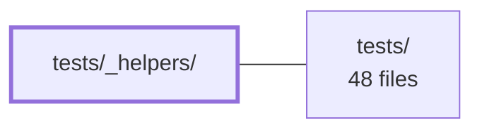

---
tags:
  - 2brain
  - 2brain/module
  - project/js-toolkit
type: module
module: tests/_helpers/
files: 2
updated: 2026-09-28T20:01:51.326332+00:00
---

# tests/_helpers/

## Purpose

`tests/_helpers/` contains small, reusable utility functions that the test suite shares for setting up common state—specifically cookies and DOM—so individual test files don't each re-implement the same setup logic.

## Key parts

- **`cookies.ts`** – Provides helpers for creating, reading, or clearing cookie values in a test context (e.g., seeding an auth cookie before an action is exercised).
- **`dom.ts`** – Provides helpers for constructing or inspecting DOM elements during a test (e.g., creating a minimal element tree or attaching listeners without a full page load).

## How it connects

- **`tests/`** (parent directory) – The test files import these helpers to reduce duplication. `tests/_helpers/` is a leaf in the dependency graph: it does not import from other application code, and nothing outside `tests/` depends on it.

## Where to start

Read **`dom.ts`** first—it is the more general of the two and shows the conventions (naming, export style, how test state is created and torn down) used across the helpers. Then skim **`cookies.ts`**, which follows the same pattern in a narrower domain. Together they take well under five minutes to read and give you the full API surface the rest of the suite relies on.

## Connected modules

[[js-toolkit_tests|tests/]]

## Files
- `tests/_helpers/cookies.ts`
- `tests/_helpers/dom.ts`

---
[[js-toolkit_INDEX|← js-toolkit index]]
