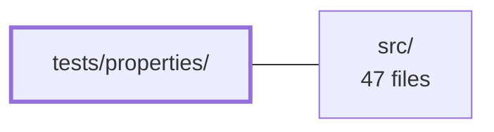

---
tags:
  - 2brain
  - 2brain/module
  - project/js-toolkit
type: module
module: tests/properties/
files: 4
updated: 2026-09-28T20:02:31.605206+00:00
---

# tests/properties/

## Purpose

Property-based test suite (via `fast-check`) that pins down algebraic invariants and structural laws for every utility function exported by the package. Instead of asserting behaviour on hand-picked examples, each file encodes universally-quantified properties—symmetry, idempotence, metric axioms, round-trip consistency—that must hold for *all* inputs within a bounded domain, catching off-by-one, sign, argument-order, and silent-refactor bugs that a handful of concrete cases would miss.

## Key parts

- **`collections.property.spec.ts`** — Verifies structural invariants and algebraic laws of the collection helpers (each `describe` block pins a small set of laws for all inputs in a bounded domain).
- **`numeric.property.spec.ts`** — Targets the four numeric geometry helpers (`getDelta`, `getMapDistance`, `rangeOverlaps`, `getOverlapRange`), encoding non-negativity, symmetry, translation invariance, boundedness, and cross-function consistency.
- **`roundtrip.property.spec.ts`** — Locks in the contract of serialization/deserialization pairs so refactors cannot silently break symmetry without tripping a property.
- **`strings.property.spec.ts`** — Covers `levenshteinDistance`, `match`, and `coerceStringArray`, encoding metric axioms, mode-lattice relationships, and normalisation rules. Sized to run fast enough inside a pre-commit hook.

## How it connects

- **`src/`** — Every file in this module imports and exercises functions exported from `src/index.ts`. The property tests are the specification-by-law counterpart to the implementation: if a function in `src/` is refactored, the invariants encoded here are the guardrail that catches contract violations before they reach consumers.

## Where to start

- **`strings.property.spec.ts`** — The most self-contained spec (three well-known functions), and the file explicitly notes it is sized to run in a pre-commit hook, making it the easiest place to see the `fast-check` patterns and project conventions in action.
- **`numeric.property.spec.ts`** — A good second read: it demonstrates how cross-function consistency properties (e.g., `rangeOverlaps` vs. `getOverlapRange`) are expressed, which is the pattern most likely to generalize to new utilities you add to `src/`.

## Connected modules

[[js-toolkit_src|src/]]

## Files
- `tests/properties/collections.property.spec.ts` — Property-based test suite (via `fast-check`) that verifies structural invariants and algebraic laws of the collection utility functions exposed by the package, rather than asserting behaviour on hand-picked examples. Each `describe` block pins down a small set of laws that must hold for *all* inputs within a bounded domain.
- `tests/properties/numeric.property.spec.ts` — Property-based test suite (fast-check) for the four numeric geometry helpers exported from `src/index.ts`: `getDelta`, `getMapDistance`, `rangeOverlaps`, and `getOverlapRange`. It encodes invariants (non-negativity, symmetry, translation invariance, boundedness, cross-function consistency) as universally-quantified properties rather than point examples, catching off-by-one, sign, and argument-order bugs that a handful of concrete cases would miss.
- `tests/properties/roundtrip.property.spec.ts` — Property-based test suite (via `fast-check`) that verifies round-trip and algebraic invariants of the utility functions exported by `src/index.ts`. It exists to pin down the *contract* of serialization/deserialization pairs so that refactors cannot silently break symmetry without tripping a property.
- `tests/properties/strings.property.spec.ts` — Property-based tests (via `fast-check`) for the three string utilities exported from `src/index.ts`: `levenshteinDistance`, `match`, and `coerceStringArray`. The tests encode the mathematical invariants (metric axioms, mode-lattice relationships, normalisation rules) that must hold for *all* inputs, not just hand-picked examples, and are sized to run fast enough inside a pre-commit hook.

---
[[js-toolkit_INDEX|← js-toolkit index]]
