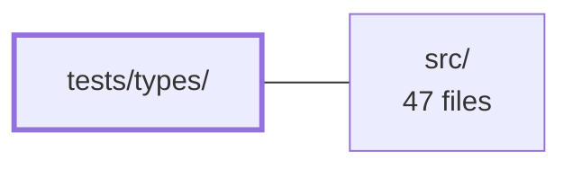

---
tags:
    - 2brain
    - 2brain/module
    - project/js-toolkit
type: module
module: tests/types/
files: 11
updated: 2026-09-28T20:02:51.601597+00:00
---

# tests/types/

## Purpose

Compile-time type-assertion suite that locks in the public API signatures of the toolkit. Every file in this directory uses the `.test-d.ts` convention (paired with `expect-type`) to verify that each exported function, interface, and overload retains a concrete, correctly constrained type. No runtime code executes; failures surface as TypeScript type-errors during the check step.

## Key parts

- **Per-domain signature tests** — One file per functional area of the toolkit, each asserting exact parameter types, return types, overloads, and optionality:
    - `arrays-and-objects.test-d.ts` – generic preservation through array/object helpers
    - `browser-platform.test-d.ts` – clipboard, cookies, downloads, query-string, FormData, file-check utilities
    - `dom.test-d.ts` – element-returning helpers keep concrete element types (no widening to `any`)
    - `errors.test-d.ts` – `extractErrorMessage` accepts `unknown`, returns `string`
    - `json.test-d.ts` – `getJson` / `isJson` return checked types, not `any`
    - `node.test-d.ts` – `deleteFile` required-argument enforcement
    - `numbers-and-ranges.test-d.ts` – numeric helpers and `IFormatCurrencyOptions`
    - `strings.test-d.ts` – fuzzy matching, edit distance, UUID generation, display formatters
    - `time.test-d.ts` – unit conversion, execution timing, date/duration formatting

- **`surface.test-d.ts`** – a single meta-guard that asserts _every_ export from the package entry point has a concrete (non-`any`) type. Catches the "any satisfies everything" regression class that per-domain files might miss if a new export is added.

- **`_fixtures.ts`** – shared type-level fixtures (helper types, sample values) used across the `.test-d.ts` files to avoid duplication.

## How it connects

This module depends on **`src/`** in one direction only: each `.test-d.ts` file imports the public types (or a representative call-site) from the toolkit's entry point and asserts on them. There is no runtime execution, so the relationship is purely at the TypeScript type level. A signature change in `src/` will cause the corresponding assertion here to fail the type-check before any consumer code compiles.

## Where to start

1. **`surface.test-d.ts`** – shortest file; shows the "every export must be concrete" pattern and introduces the `expect-type` idiom in context.
2. **`arrays-and-objects.test-d.ts`** – the most representative per-domain file: demonstrates generic preservation, overload checking, and parameter-constraint assertions in a single file. Reading it after `surface.test-d.ts` gives you the full mental model of how this directory protects the API.

## Connected modules

[[js-toolkit_src|src/]]

## Files

- `tests/types/_fixtures.ts`
- `tests/types/arrays-and-objects.test-d.ts` — A type-level (compile-time) test that verifies the generic signatures of the array and object helper functions exported by the toolkit. It ensures element types are preserved through generic parameters rather than collapsing to `unknown[]`, and that overloaded and parameter-constrained call sites are correctly typed.
- `tests/types/browser-platform.test-d.ts` — Compile-time type-test for the browser-platform utilities (clipboard, cookies, downloads, query strings, FormData, file checks). It asserts via `expect-type` that every public export has a well-known, non-`any` signature and that specific invalid call sites are rejected by the type system. It guards against silent type regressions without executing any runtime code.
- `tests/types/dom.test-d.ts` — Compile-time type-assertion suite for the DOM helper functions exported by the toolkit. It verifies that element-returning helpers preserve concrete element types (rather than widening to `any` or a bare object), so downstream callers can chain DOM operations without casting.
- `tests/types/errors.test-d.ts` — Compile-time type test that locks down the public signature of `extractErrorMessage` from the toolkit. It exists to guarantee that the function accepts `unknown` (matching what a `catch` block yields), returns `string`, and restricts its optional fallback to `string`—all without executing any runtime code.
- `tests/types/json.test-d.ts` — Type-level test (`.test-d.ts` convention) that asserts the public signatures of the JSON helpers exported from `src/index.ts`. It exists to lock in the contract that both `getJson` and `isJson` return concrete, checked types (`unknown`, a specific union) rather than `any`, and that `isJson`'s `false` sentinel is unambiguous. No runtime code executes.
- `tests/types/node.test-d.ts` — Compile-time type-test for the `deleteFile` helper exported by the toolkit. It asserts the exact function signature and confirms that the required `filePath` argument is enforced, ensuring no accidental type regressions (e.g., widening to `any` or making the argument optional).
- `tests/types/numbers-and-ranges.test-d.ts` — Compile-time type assertions (via `expect-type`) that lock down the exact public signatures of the toolkit's numeric and range helpers — `getDelta`, `getMapDistance`, `rangeOverlaps`, `getOverlapRange`, and `formatCurrency` — plus the `IFormatCurrencyOptions` interface. The file exists so that any unintended signature change (parameter reordering, widened return types, added optionality) fails the type-check before it ships.
- `tests/types/strings.test-d.ts` — Compile-time type assertion file (`.test-d.ts`) that pins down the public type signatures of the string-related exports (fuzzy matching, edit distance, UUID generation, and the two plain-text display formatters). It exists to make sure the API surface cannot silently drift — a signature change in `src` that breaks a consumer's expectations will fail type-checking before any runtime test runs.
- `tests/types/surface.test-d.ts` — Compile-time guard that asserts every public export from the toolkit's entry point retains a concrete type rather than silently widening to `any`. Because `any` satisfies every downstream type assertion, a regression to `any` would leave the unit suite green while erasing type-safety for all consumers. This file makes that regression a hard type-error at check time.
- `tests/types/time.test-d.ts` — Type-level test file that asserts the public TypeScript signatures of the toolkit's time-related utilities (unit conversion, execution timing, and date/duration formatting). It exists to catch accidental signature changes in the type system before they reach consumers, without any runtime execution.

---

[[js-toolkit_INDEX|← js-toolkit index]]
