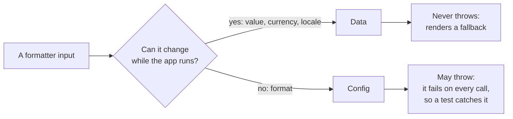

# Getting Started

`@guebbit/js-toolkit` is a small set of framework-free TypeScript helpers for the things that keep
coming up: array and object reshaping, string matching, ranges and distances, time conversion,
display formatting, cookies, query strings, and the DOM chores that predate a framework.

Every function is a default export of its own module and is re-exported by name from the package
root. Nothing here wraps a library — if lodash already does it well, it is not in this toolkit.

- No runtime dependencies
- TypeScript throughout, with declarations published for both module formats
- Real ESM and CommonJS builds, so `import` and `require` both work natively
- Every helper is importable on its own, and `sideEffects: false` lets a bundler drop whatever you
  do not use
- Node 20+

## Install

```sh
npm install @guebbit/js-toolkit
```

## Usage

```ts
import { arrayChunks, getMapDistance, match, setUrlQueries } from '@guebbit/js-toolkit'

arrayChunks(['a', 'b', 'c', 'd', 'e'], 2) // [['a', 'b', 'c'], ['d', 'e']]
getMapDistance(0, 3, 0, 4) // 5
match('Ipsum', 'lorem ipsum sit') // true  — case-insensitive, first inside second
setUrlQueries({ tags: ['a', 'b'], page: 2 }) // 'tags=a%2Cb&page=2'
```

## ESM vs CommonJS

Import a single helper instead, when you would rather not go through the barrel:

```ts
import getMapDistance from '@guebbit/js-toolkit/getMapDistance'
```

CommonJS works the same way:

```js
const { arrayChunks } = require('@guebbit/js-toolkit')
const getDelta = require('@guebbit/js-toolkit/getDelta').default
```

There is no default export on the barrel — it exports names. Every one of these forms, both module
systems and both subpath styles, is exercised against a real packed tarball on each build (see
[Testing](./testing)).

### Subpath imports and `moduleResolution`

A subpath import (`@guebbit/js-toolkit/getCookie`, either form above) needs a `moduleResolution` of
`node16`, `nodenext` or `bundler` in the consuming project's `tsconfig.json` — the same setting
most modern TypeScript projects already use. Under the legacy `node10` resolution, `exports` in
`package.json` is ignored entirely, so a subpath's types cannot be found; only the main import
(`import { getCookie } from '@guebbit/js-toolkit'`) is supported there. `tests/package/attw.mjs`
checks the main import under every resolution mode, including `node10`, and every subpath under
`node16`/`bundler` — never `node10` — so this gap is enforced, not just documented.

## Browser and Node

Most helpers are environment-agnostic. The DOM helpers need a `document` (a browser or jsdom), and
`deleteFile` is Node-only — it is the single module that imports `node:fs/promises`. Because each
helper is its own module and the package is side-effect free, importing the pure ones from a server
bundle does not drag the DOM ones in.

## What the formatters throw

The display formatters (`formatCurrency`, `formatDateTime`, …) sit in render paths, where a throw
takes a whole view down. So each input is sorted by one question: can it change while the app runs?



| Input      | Kind   | When it is unusable                                                        |
| ---------- | ------ | -------------------------------------------------------------------------- |
| `value`    | data   | renders `empty`                                                            |
| `currency` | data   | malformed (`'EU'`, `''`): a plain number, no symbol                        |
| `locale`   | data   | malformed (`'en_US'`, `''`) or unknown (`'zz'`): the runtime's own default |
| `format`   | config | throws a `RangeError` or `TypeError`, straight from `Intl` — a caller bug  |

- **A locale is data.** It usually arrives at runtime: `navigator.language`, a user setting, an
  `Accept-Language` header, an i18n library. A POSIX-style `'en_US'` is a realistic input that no
  test fixture will contain.
- **A malformed locale is treated like an unknown one.** `Intl` already falls back on its own for
  a well-formed tag it has no data for (`'zz'`). It only throws on a malformed one. The formatters
  map that case onto the same fallback, using the spec's own check (`Intl.getCanonicalLocales`).
- **`format` is config.** It is an object written in code, so a bad one fails on every call, in
  development and in tests, not only in production.

## What to use, and when

- **[Arrays and objects](/api/arrays-and-objects)** — reshaping, slicing and coercing plain data.
- **[Strings](/api/strings)** — fuzzy matching, edit distance, id generation, plain-text display.
- **[Errors](/api/errors)** — a readable message out of anything a `catch` or a rejected promise
  hands you.
- **[Numbers and ranges](/api/numbers-and-ranges)** — distances, overlaps, currency display.
- **[Time](/api/time)** — seconds to every unit, durations, execution timing, date display.
- **[JSON](/api/json)** — parsing that never throws.
- **[DOM](/api/dom)** — the jQuery-shaped chores a framework usually hides.
- **[Browser platform](/api/browser-platform)** — clipboard, downloads, cookies, query strings,
  `FormData`, client-side file checks.
- **[Node](/api/node)** — the one helper that only runs outside a browser.

Each reference page documents every export's parameters, return value and defaults.
