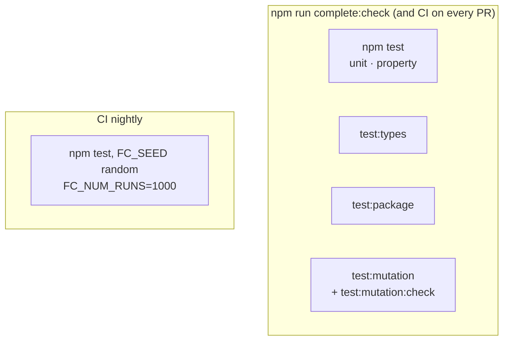

# Testing

Five layers, each catching a kind of bug the others cannot see.



The unit suite tells you the code works on the cases someone thought of. Property tests tell you it
works on cases nobody thought to write down. The type-level suite tells you the public API's
_shape_ hasn't quietly changed. The packaging suite tells you it works once actually installed, not
just inside this repo. Mutation testing tells you whether all of the above would actually _notice_
a bug. You want all of them, and `complete:check` runs every one except the mutation gate's own
report generation — `test:mutation` and `test:mutation:check` run in CI on every PR too, just not
as part of the local `complete:check`, since a full mutation run is the slowest layer by far.

## Unit tests — `tests/*.spec.ts`

One file per public export, imported through the barrel (`from '../src'`) so the barrel itself is
exercised too. Written against the contract, not the implementation: a refactor that preserves
behaviour keeps them green.

Comments say why a case exists and what breaks without it. A case that pins surprising-but-correct
behaviour says so, to stop the next reader "fixing" it. A confirmed bug not yet fixed gets an
`it.failing` test with a `Known bug:` comment naming the cause; the fix flips it back to `it`.

Shared fakes live in `tests/_helpers/` (a `getBoundingClientRect` stub, cookie-jar teardown) —
reused instead of re-stubbed per spec. A stub only one spec needs stays in that spec.

### What jsdom does not cover

Jest runs in jsdom by default. jsdom has the DOM's shape, not its behaviour: no layout
(`getBoundingClientRect` is all zeroes unless stubbed), no CSS, no `Blob.text()`. Tests for
`getElementCenter`, `isInViewport` and anything layout-dependent assert against stubbed rects
rather than real geometry — a green DOM test means "the logic is right", not "this works in
Safari". A case that needs a runtime with no DOM at all opts into Node with a docblock:

```ts
/**
 * @jest-environment node
 */
```

`tests/getUrlQueries.node.spec.ts` is the one case today — `getUrlQueries` falls back to `''` when
`location` does not exist, which jsdom always provides.

## Property tests — `tests/properties/*.property.spec.ts`

[fast-check](https://fast-check.dev) over the pure functions. These state laws rather than
examples: round trips (`getUrlQueries(setUrlQueries(x)) === x`), idempotence (`canonicalize`),
symmetry and the triangle inequality (`levenshteinDistance`), bounds that hold for every input
(`getDelta` never exceeds half the circumference). Grouped by theme rather than by module, since a
property here often spans two exports (`roundtrip` pairs `getUrlQueries` with `setUrlQueries`, and
`secondsToTime` with `timeToSeconds`).

**Setup:** `tests/_setup/fastCheck.ts`, loaded once via Jest's `setupFiles`, configures every run:

- `FC_NUM_RUNS` (default 100) — how many generated cases each property tries.
- `FC_SEED` (default 42, fixed) — pins fast-check's random generator.

The seed is fixed so the mutation score is a property of the tests, not of the day: a random seed
would let a mutant get killed on one run and survive the next, making the per-file baseline drift
on its own and a real regression indistinguishable from noise. The `Nightly` workflow re-runs
everything on a fresh random seed with ten times the cases, so new counterexamples still surface
without destabilising the per-commit gate:

```sh
FC_SEED=$RANDOM FC_NUM_RUNS=1000 npm test
```

Anything a new seed finds gets committed as a named regression case in the matching unit spec, so
it is caught by every run afterwards rather than waiting for that seed to come round again.

## Type-level tests — `tests/types/*.test-d.ts`

A signature that quietly widens to `any` is a breaking change no runtime assertion can see: `any`
satisfies every call, so the unit suite stays green while every caller loses their checks.
[`expect-type`][expect-type] assertions on the exported signatures, one file per API category
(matching the [reference pages](/api/arrays-and-objects)), plus `surface.test-d.ts` holding the
"nothing is `any`" assertion for every export.

```ts
// Inference: a tuple, not number[] — callers destructure `const [start, end] = ...`
expectTypeOf(toolkit.getOverlapRange).returns.toEqualTypeOf<[number, number]>()

// Refusal: currency has to be a string
// @ts-expect-error -- currency has to be a string
toolkit.formatCurrency(10, { currency: 978 })
```

**These are enforced by `tsc`, not by Jest.** `isolatedModules` in `tsconfig.json` puts ts-jest in
transpile-only mode, so a type error in a spec never fails a Jest run. `npm run test:types` runs
`tsc -p tsconfig.types.json` — a plain `tsc` program with `types: ["node"]` (no Jest globals), so
nothing here can lean on `describe`/`expect` to paper over a missing import. It is part of
`complete`/`complete:check` and its own CI job.

`npm run typecheck` (`tsc -p tsconfig.json && tsc -p tsconfig.tests.json`) is a separate, broader
check: it type-checks every spec file too, which `test:types` does not.

## Built-package tests — `tests/package/`

Every layer above runs against `src/`, through ts-jest — never against what actually ships.
`npm run test:package` closes that gap:

- **`publint --strict`** — do `exports`/`main`/`types`/`files` point at files that actually exist?
- **`attw.mjs`** — [Are the Types Wrong](https://github.com/arethetypeswrong/arethetypeswrong.github.io)
  run twice: once on the auto-detected entry points (catches the main import under every resolution
  mode, including `node10`), once naming every subpath explicitly under `--profile node16` (attw
  lists a wildcard subpath export as `(wildcard)` and never checks it otherwise — see
  [Subpath imports](./getting-started#subpath-imports-and-moduleresolution)).
- **`smoke.mjs`** — builds a real tarball with `npm pack`, installs it into a throwaway directory,
  and imports it every way a consumer can: `require` and `import`, from the barrel and from a
  subpath, then type-checks a consumer of each module kind. Also the **public-API guard**:
  `tests/package/exports.json` is a frozen list of runtime exports, checked against `src/` in both
  directions — deleting a helper without editing that list (plus a **BREAKING** CHANGELOG line)
  fails here.
- **`dtsGuard.mjs`** — the ESM and CommonJS declaration trees must describe the same modules, no
  `.d.ts` may import a `node:` builtin except `deleteFile`'s, and none may import `internal/`
  (dormant until `src/internal/` exists — see CLAUDE.md, "Function design").

The dual build is the sharp edge these catch and nothing else does: the root package is
`"type": "module"`, so `dist/cjs` only parses as CommonJS because the build writes a
`{"type":"commonjs"}` marker into it — lose that file and `require()` dies at runtime while every
unit test stays green. Declarations are emitted **per format**, and the `types` condition sits
inside `import`/`require` — one shared declaration folder would be read as ESM by TypeScript, and a
CommonJS consumer could not import the package at all.

## Mutation testing — Stryker

```sh
npm run test:mutation               # full run, produces reports/mutation/
npm run test:mutation:incremental   # skip mutants unchanged since the last incremental run
npm run test:mutation:check         # gates on mutation-baseline.json
```

### Why example-based tests aren't enough

A passing test suite doesn't mean the tests are good. A test can pass for the wrong reason: it
might only check a value the code happens to produce anyway, or never exercise a branch at all. Line
coverage says a line _ran_ during the tests; it says nothing about whether any assertion would
_fail_ if that line were wrong. Mutation testing measures the thing coverage can't: do the tests
actually catch bugs?

[Stryker](https://stryker-mutator.io/) makes a small, deliberate change to the source — a mutation,
such as `if (cond)` → `if (false)`, `===` → `!==`, `a + b` → `a - b` — one at a time, and re-runs
the Jest suite against each mutated copy. A mutant is **killed** if a test fails (good — the tests
noticed), or **survived** if every test still passes (a hole: something the code does is not
verified by any assertion).

### Per-file, not global

`mutation-baseline.json` holds two scores per file:

- `covered` — of the mutants a test executes, how many an assertion catches.
- `total` — the same, also counting mutants no test reaches at all.

They call for different work. `total` well below `covered` means code nothing executes: write a
test that runs it. Both low and close together means tests run the code without asserting on it:
sharpen an assertion that already exists.

A file below its baseline fails the run, and the baseline is **not** rewritten — a regression must
never become the new normal. A file above its baseline has it raised, locking the gain in. Per file,
never one global percentage: a global number lets a strong file carry a weak one, and a file could
rot all the way down while the headline score holds. A missing baseline entry fails outright in CI
(`process.env.CI`) instead of silently recording one — every file is gated by design, not by
someone remembering to run `--init` after adding a source file.

To start a baseline from scratch:

```sh
node scripts/mutation-baseline.mjs --init
```

### Survivors that are meant to survive

Some mutants change nothing observable — a fast path that produces the same answer as the general
path, a shortcut for a case another guard already handles. Chasing them means writing a test that
asserts on an implementation detail rather than on behaviour. They are marked in the source with a
comment saying why, so nobody re-chases them, and the file's baseline entry carries a matching
`note`. `mutation-baseline.json` only moves up otherwise — never lower it to get a run green.

### Running it in CI

`.github/workflows/ci.yml`'s `test-mutation` job runs the full suite on every PR — the per-file gate
only works if it actually runs, and a full run finishes in a couple of minutes, well under the
point where `--incremental` (with a cache, the way `mutation.yml` in `../vue-toolkit` does it) would
be worth the extra complexity. `.github/workflows/nightly.yml` covers the property-test fuzzing
instead (see [Property tests](#property-tests-tests-properties-property-spec-ts) above).

[expect-type]: https://github.com/mmkal/expect-type
